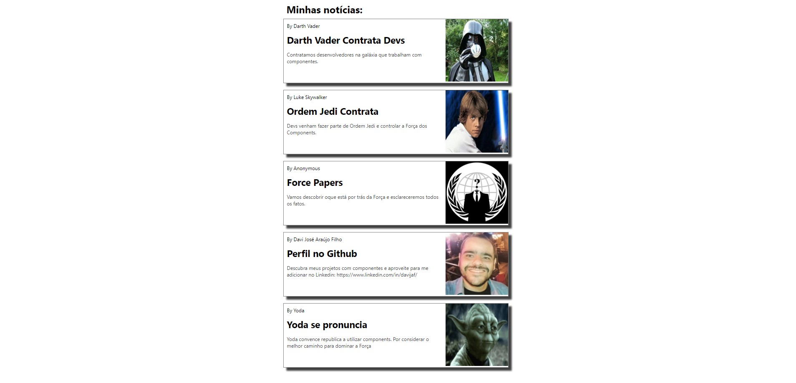

# Portal de Noticias Galáctica
Este é o repositório do Portal de Noticias Galáctica, uma aplicação web desenvolvida utilizando web components.

## Recursos Utilizados
* HTML
* CSS (styles/cards.css)
* JavaScript (src/Components/*.js)

## Componentes
* `<hello-world>`: Exibe uma mensagem de boas-vindas.
* `<titulo-dinamico>`: Exibe um título dinâmico, que pode ser definido através da propriedade titulo.
* `<card-news>`: Exibe uma notícia, com as propriedades: autor, title, link-url, link-image, content.

Este código define um componente web personalizado chamado "card-news" usando a classe JavaScript "CardNews" que estende a classe built-in "HTMLElement".

A classe possui uma função construtora que anexa um shadow DOM ao componente, e adiciona os métodos "build" e "styles" a ele.

O método "build" cria a estrutura do componente, incluindo divs para as seções esquerda e direita do cartão, elementos como spans, anchors e images, e define suas propriedades e conteúdo com base nas atributos passados para o componente quando ele é usado na página HTML.

O método "styles" cria um elemento "style" e define os estilos CSS para o componente.

Por fim, o elemento personalizado é registrado usando o método "customElements.define".

## Execução

Para executar a aplicação, basta abrir o arquivo index.html em um navegador.

A seguir, segue o print da telas do projeto:

